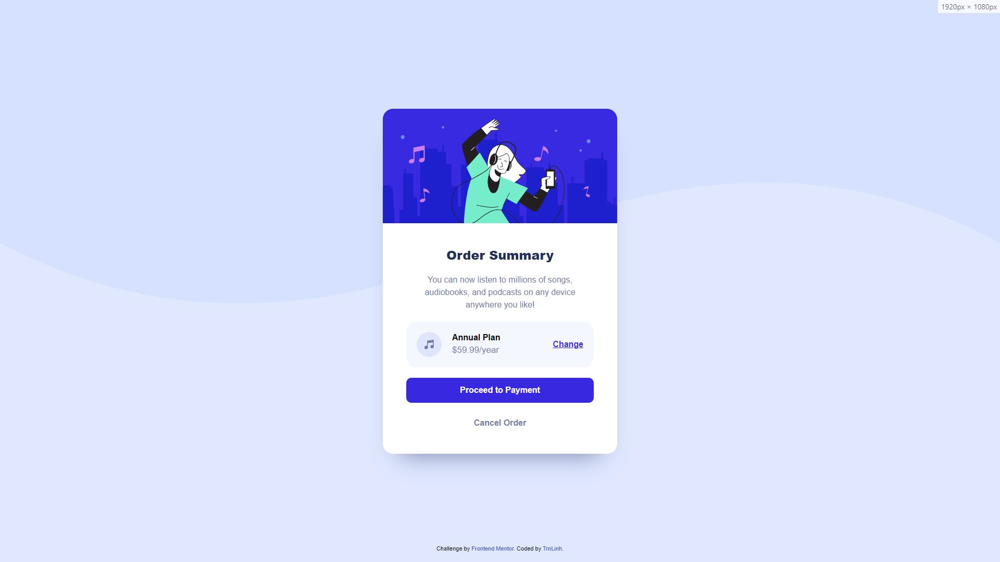
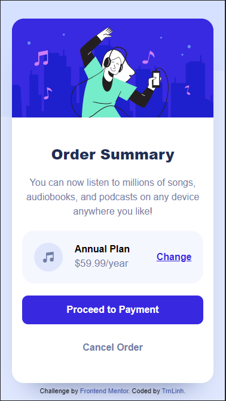

# Frontend Mentor - Order summary card solution

This is a solution to the [Order summary card challenge on Frontend Mentor](https://www.frontendmentor.io/challenges/order-summary-component-QlPmajDUj). Frontend Mentor challenges help you improve your coding skills by building realistic projects.

## Table of contents

- [Overview](#overview)
  - [The challenge](#the-challenge)
  - [Screenshot](#screenshot)
  - [Links](#links)
- [My process](#my-process)

  - [Built with](#built-with)
  - [What I learned](#what-i-learned)

  - [Useful resources](#useful-resources)

- [Author](#author)

**Note: Delete this note and update the table of contents based on what sections you keep.**

## Overview

### The challenge

Users should be able to:

- See hover states for interactive elements

### Screenshot




### Links

- Solution URL: [GitHub for solution](https://github.com/TrnLinh/Frontend-Mentor---Order-summary-card-solution.github.io.git)
- Live Site URL: [Add live site URL here](https://trnlinh.github.io/Frontend-Mentor---Order-summary-card-solution.github.io/)

## My process

- First I layout all the thing I gonna style into difference part
- When everything set up i start CSS and never have to touch html anymore

### Built with

- CSS custom properties
- Flexbox
- CSS Grid

### What I learned

Use this section to recap over some of your major learnings while working through this project. Writing these out and providing code samples of areas you want to highlight is a great way to reinforce your own knowledge.

To see how you can add code snippets, see below:

```html
<div class="annual-plan">
  
  <div class="annual-grid">
    <div class="left">
      <p class="annual-title">Annual Plan</p>
      <p class="pay">$59.99/year</p>
    </div>
    <div class="right">
      <a href="#"><p class="change">Change</p></a>
    </div>
  </div>
</div>
```

```css
.annual-plan {
  background-color: var(--Very-pale-blue);
  display: flex;
  padding: 20px;
  border-radius: 20px;
  margin: 20px 0;
}
.annual-grid {
  display: grid;
  grid-template-columns: auto auto;
  width: 100%;
}
.left {
  display: grid;
  text-align: left;
  align-items: center;
  margin-left: 20px;
}
.annual-title {
  font-weight: 600;
}
.pay {
  color: var(--Desaturated-blue);
  font-weight: 500;
  font-size: 17px;
}

.right {
  text-align: right;
  display: grid;
  align-items: center;
}
.change {
  color: var(--Bright-blue);
  text-decoration: underline;
  font-weight: 700;
}
.change:hover {
  opacity: 0.8;
  text-decoration: none;
}
```

```js
"I don't use js in this solution";
```

### Continued development

Me Myself just new to CSS dor a couple month so I still have alot of thing to learn. i hope in the future I will be able to learn js and start using framework

### Useful resources

- [Example resource 1](https://www.w3schools.com/) - This is where i usually find everything I'm looking for
- [Example resource 2](https://stackoverflow.com/) - Another great place to find answer to your problem

## Author

- Frontend Mentor - [@TrnLinh](https://www.frontendmentor.io/profile/TrnLinh)
